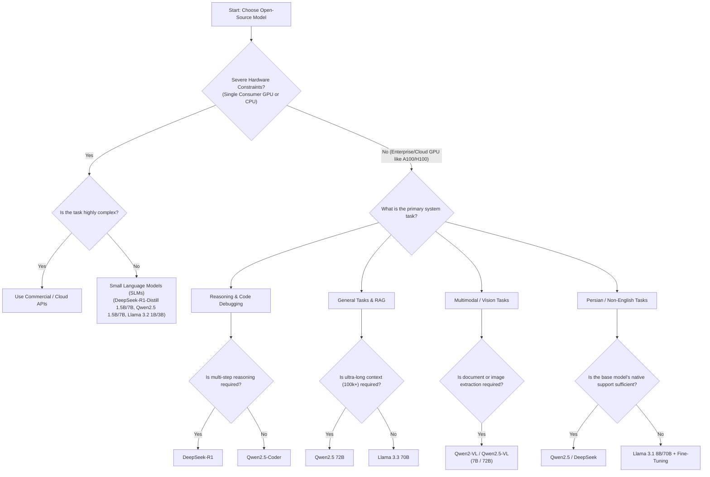

# Agent orchestration

## Brainstorm on commercial models

## Brainstorm on Open-source models

```mermaid
flowchart TD
    Start["Start: Choose Open-Source Model"] --> HardwareCheck{"Severe Hardware Constraints?\n(Single Consumer GPU or CPU)"}
    
    %% Branch: Hardware Constraints = Yes
    HardwareCheck -- Yes --> TaskComplex{"Is the task highly complex?"}
    TaskComplex -- Yes --> CloudAPI["Use Commercial / Cloud APIs"]
    TaskComplex -- No --> SLM["Small Language Models (SLMs)\n(DeepSeek-R1-Distill 1.5B/7B, Qwen2.5 1.5B/7B, Llama 3.2 1B/3B)"]
    
    %% Branch: Hardware Constraints = No
    HardwareCheck -- No (Enterprise/Cloud GPU like A100/H100) --> PrimaryTask{"What is the primary system task?"}
    
    %% Task 1: Reasoning & Code Debugging
    PrimaryTask --> TaskCode["Reasoning & Code Debugging"]
    TaskCode --> NeedReasoning{"Is multi-step reasoning required?"}
    NeedReasoning -- Yes --> R1["DeepSeek-R1"]
    NeedReasoning -- No --> QwenCoder["Qwen2.5-Coder"]
    
    %% Task 2: General & RAG Tasks
    PrimaryTask --> TaskRAG["General Tasks & RAG"]
    TaskRAG --> LongContext{"Is ultra-long context (100k+) required?"}
    LongContext -- Yes --> Qwen72B["Qwen2.5 72B"]
    LongContext -- No --> Llama70B["Llama 3.3 70B"]
    
    %% Task 3: Vision / Multimodal Tasks
    PrimaryTask --> TaskVision["Multimodal / Vision Tasks"]
    TaskVision --> VisionExtract{"Is document or image extraction required?"}
    VisionExtract -- Yes --> QwenVL["Qwen2-VL / Qwen2.5-VL\n(7B / 72B)"]
    
    %% Task 4: Persian & Non-English Tasks
    PrimaryTask --> TaskLang["Persian / Non-English Tasks"]
    TaskLang --> BaseSufficient{"Is the base model's native support sufficient?"}
    BaseSufficient -- Yes --> QwenDeepSeek["Qwen2.5 / DeepSeek"]
    BaseSufficient -- No --> LlamaFineTune["Llama 3.1 8B/70B + Fine-Tuning"]
```