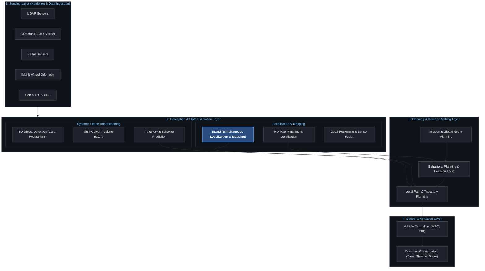

# Automated Driving

The whole system architecture:

1. **Sensing Layer:** Raw data acquisition from physical sensors (LiDAR, Cameras, Radar, IMU, GNSS).
2. **Perception & State Estimation Layer:**
   * **Localization & Mapping:** Determining exact vehicle pose via **SLAM** or **HD-Map Matching**.
   * **Dynamic Perception:** 3D object detection, multi-object tracking, and trajectory prediction.
3. **Planning Layer:** Behavioral decision-making and optimal collision-free path/trajectory generation.
4. **Control & Actuation Layer:** Executing steering, throttle, and brake commands (e.g., via MPC/PID controllers) to track planned trajectories.
