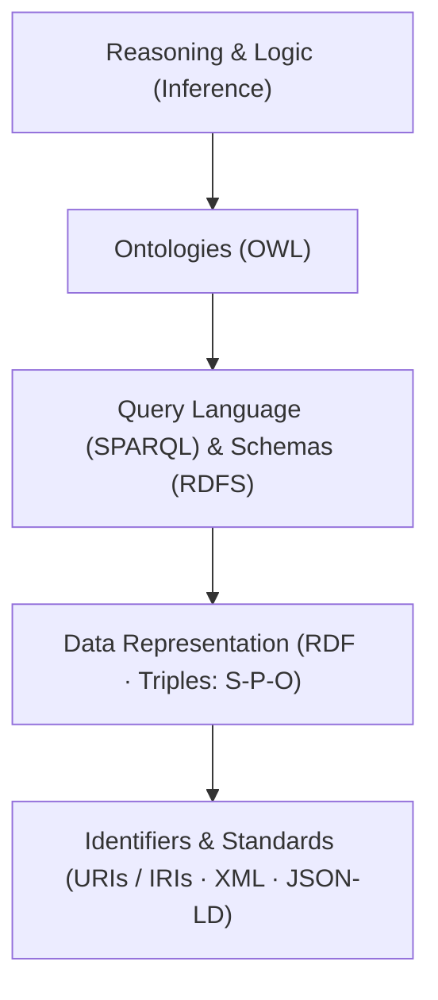

# Cognitive AI and Knowledge Driven systems

## Semantic Web Stack

- Unique Identifiers (URIs / IRIs): Provide unambiguous, global identifiers for entities, concepts, and relationships
- Resource Description Framework (RDF): The standard graph data model that represents facts as structured triples: $\text{(Subject} \rightarrow \text{Predicate} \rightarrow \text{Object)}$.
- Ontologies & Logic (RDFS & OWL): Express domain schemas, class hierarchies, and logical rules/axioms (e.g., inverse relations, transitivity) to formalize domain knowledge.
- Query Language (SPARQL): The standard declarative query language designed to extract and manipulate data stored in RDF graphs (analogous to SQL for relational databases).
- Inference & Reasoning: Rule engines embedded in Triple Stores (e.g., GraphDB, Apache Jena) that automatically deduce implicit facts from explicit data and ontological rules.