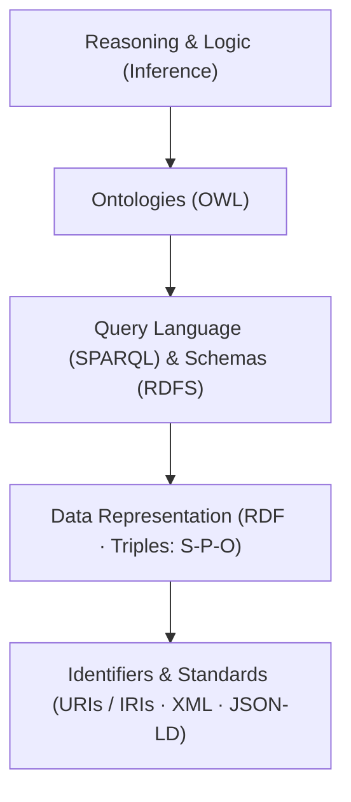

# Cognitive AI and Knowledge Driven systems

## Semantic Web Stack

- Unique Identifiers (URIs / IRIs): Provide unambiguous, global identifiers for entities, concepts, and relationships
- Resource Description Framework (RDF): The standard graph data model that represents facts as structured triples: $\text{(Subject} \rightarrow \text{Predicate} \rightarrow \text{Object)}$.
- Ontologies & Logic (RDFS & OWL): Express domain schemas, class hierarchies, and logical rules/axioms (e.g., inverse relations, transitivity) to formalize domain knowledge.
- Query Language (SPARQL): The standard declarative query language designed to extract and manipulate data stored in RDF graphs (analogous to SQL for relational databases).
- Inference & Reasoning: Rule engines embedded in Triple Stores (e.g., GraphDB, Apache Jena) that automatically deduce implicit facts from explicit data and ontological rules.

### RDF Triples vs. Semantic Data Models (Ontologies)

> **Analogy:** **RDF Triples** are the *building blocks (bricks)*, while **Ontologies / Semantic Data Models** are the *architectural blueprint and structural rules*.

#### 1. RDF Triples: The Data Units (The "Bricks")

* **What they are:** The atomic data format used to state simple, explicit facts.
* **Structure:** Formatted as $\text{(Subject} \rightarrow \text{Predicate} \rightarrow \text{Object)}$ (e.g., `Engine` $\rightarrow$ `isPartOf` $\rightarrow$ `Vehicle`).
* **Role:** They store the raw factual data in a graph format, similar to how individual rows store data in a relational database table.

#### 2. Ontologies & Semantic Data Models: The Schema & Logic (The "Blueprint")

* **What they are:** Formal specifications (defined using **RDFS** or **OWL**) that define the classes, properties, hierarchy, and logical constraints governing the triples.
* **Core Components:**
* **Controlled Vocabularies & Taxonomies:** Standardized entity names and class hierarchies (e.g., `BrakeSensor` is a subclass of `SafetyComponent`).
* **Relationship Definitions:** Specifying domain, range, and semantics of predicates (e.g., establishing that `isPartOf` is a **transitive** relation, or that `sendsDataTo` is the **inverse** of `receivesDataFrom`).
* **Logical Axioms & Reasoning:** Enabling inference engines to automatically deduce implicit knowledge from explicit triples.

---

### 💡 Summary for Industrial Context (e.g., BMW / Bosch)

When automotive or engineering companies refer to **Semantic Data Models**, they don't just mean storing raw RDF triples in a database. They mean having a **rigorous, rule-based ontology** that models domain logic and dependencies, allowing both automated reasoning engines and LLMs/VLMs to interpret technical engineering systems deterministically without ambiguity.