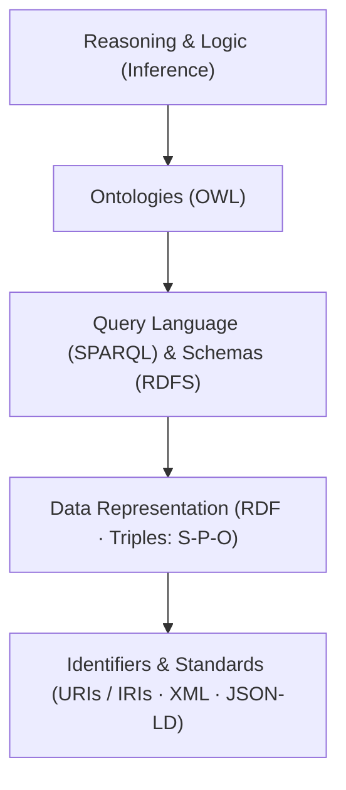
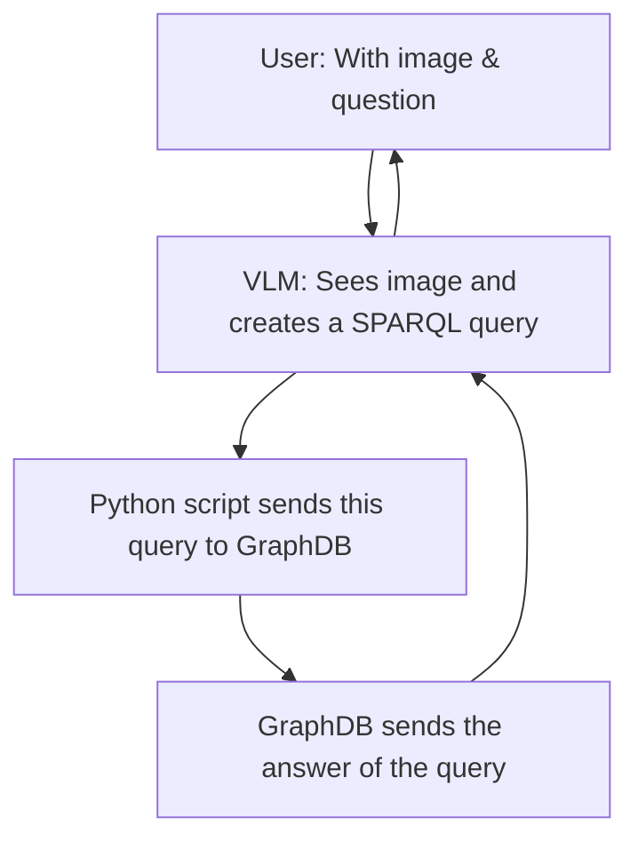

# Cognitive AI and Knowledge Driven systems

## Semantic Web Stack

Inside the GraphDB engine:

- Unique Identifiers (URIs / IRIs): Provide unambiguous, global identifiers for entities, concepts, and relationships
- Resource Description Framework (RDF): The standard graph data model that represents facts as structured triples: $\text{(Subject} \rightarrow \text{Predicate} \rightarrow \text{Object)}$.
- Ontologies & Logic (RDFS & OWL): Express domain schemas, class hierarchies, and logical rules/axioms (e.g., inverse relations, transitivity) to formalize domain knowledge.
- Query Language (SPARQL): The standard declarative query language designed to extract and manipulate data stored in RDF graphs (analogous to SQL for relational databases).
- Inference & Reasoning: Rule engines embedded in Triple Stores (e.g., GraphDB, Apache Jena) that automatically deduce implicit facts from explicit data and ontological rules.

### RDF Triples vs. Semantic Data Models (Ontologies)
When automotive or engineering companies refer to **Semantic Data Models**, they don't just mean storing raw RDF triples in a database. They mean having a **rigorous, rule-based ontology** that models domain logic and dependencies, allowing both automated reasoning engines and LLMs/VLMs to interpret technical engineering systems deterministically without ambiguity.

> **Analogy:** **RDF Triples** are the *building blocks (bricks)*, while **Ontologies / Semantic Data Models** are the *architectural blueprint and structural rules*.

#### 1. RDF Triples: The Data Units (The "Bricks")

* **What they are:** The atomic data format used to state simple, explicit facts.
* **Structure:** Formatted as $\text{(Subject} \rightarrow \text{Predicate} \rightarrow \text{Object)}$ (e.g., `Engine` $\rightarrow$ `isPartOf` $\rightarrow$ `Vehicle`).
* **Role:** They store the raw factual data in a graph format, similar to how individual rows store data in a relational database table.

#### 2. Ontologies & Semantic Data Models: The Schema & Logic (The "Blueprint")

* **What they are:** Formal specifications (defined using **RDFS** or **OWL**) that define the classes, properties, hierarchy, and logical constraints governing the triples.
* **Core Components:**
    * Controlled Vocabularies & Taxonomies: Standardized entity names and class hierarchies (e.g., `BrakeSensor` is a subclass of `SafetyComponent`).
    * Relationship Definitions: Specifying domain, range, and semantics of predicates (e.g., establishing that `isPartOf` is a **transitive** relation, or that `sendsDataTo` is the **inverse** of `receivesDataFrom`).
    * Logical Axioms & Reasoning: Enabling inference engines to automatically deduce implicit knowledge from explicit triples.

## Implementation

The RAG application pipeline:

The whole pipeline:
Decoupling of the Offline Phase (Knowledge Base Preparation) and the Online Phase (Inference)

* Offline Phase / Knowledge Base Preparation:
    * Step 1 (Knowledge Graph Construction): This phase consists purely of constructing, structuring, and ingesting RDF knowledge triples into GraphDB (without updating model weights). This process is executed once offline to establish the non-parametric memory of the architecture.

* Online Phase / Real-Time Inference Pipeline:
    * Step 2 (Entity Extraction): Upon receiving a new image and query, the pre-trained Vision-Language Model (e.g., Qwen2-VL) extracts visual concepts and grounded entities during the forward inference pass.
    * Step 3 (SPARQL Query Generation): The model or pipeline dynamically constructs the corresponding SPARQL query via in-context prompting strategies (such as Few-Shot In-Context Learning).
    * Step 4 (Graph Retrieval): The generated query is executed against GraphDB to retrieve relevant relational triples linked to the visual input in real time.
    * Step 5 (Grounded Response Generation): Conditioning on the augmented prompt (comprising the input image, user question, and retrieved triples), the model generates the grounded, verified final response within the same inference phase.

**Prompt engineering** is designing prompts when we are talking to LLM/VLM model. This happens **2 times** in the pipeline. First is when we are getting SPARQL queries to send them to GraphDB and the second is when we got the answer from GraphDB and we want to tell LLM/VLM instructions on how to work with this answer.

### Different Graph DBs
Graph databases are broadly divided into dozens of implementations across two primary architectural paradigms:

* **Labeled Property Graphs (LPG):** **Neo4j** is the most prominent engine in this category, utilizing the **Cypher** query language rather than the RDF standard. Other notable LPG engines include **Amazon Neptune**, **Memgraph**, and **TigerGraph**.
* **Semantic Web Graph Stores (RDF Triplestores):** These natively adhere to the **W3C RDF** standard and utilize **SPARQL** for querying, which matches the requirements of your project. Key implementations include:
* **Ontotext GraphDB** (the specific enterprise product bearing this name)
* **Apache Jena (TDB / Fuseki)**
* **OpenLink Virtuoso**
* **Blazegraph**
* **Stardog**

In summary, while Neo4j is indeed a graph database, it belongs to the LPG category and does not natively run SPARQL. For a Knowledge-Grounded Multimodal RAG pipeline built on RDF specifications, **Ontotext GraphDB** or **Apache Jena** is the standard choice.

## Open source vehicle related ontologies and knowledge bases

Several standardized and open-source ontologies and knowledge bases are widely utilized in academic research and graduate theses within the automotive domain:
### 1. Open and Standard Automotive Ontologies

* **VSSo (Vehicle Signal Specification Ontology):** A standard ontology developed by the W3C and COVESA to model vehicle signals, sensor data, and internal vehicle telemetry in OWL/RDF format.
* **Auto (Automotive Ontology):** An ontology developed on top of schema.org for the structured representation of technical specifications, mechanical components, powertrain variants, automotive models, and vehicle body classifications.
* **Car Ontology (W3C / GoodRelations):** A formal vocabulary designed to model detailed technical specifications, commercial configurations, and physical attributes of automobiles.

### 2. General Public Knowledge Bases

* **Automotive Subgraphs in DBpedia and Wikidata:** Triples connected to the `dbo:Automobile` class hierarchy, including component classifications, standardized failure modes, and brand-specific technical specifications, retrievable via public SPARQL endpoints.

### Exemplary Academic Project Scenario

A representative methodology for academic and research evaluation involves the following pipeline:

* **Domain Definition:** Automotive fault diagnostics or technical specification recommendation systems.
* **Knowledge Graph Architecture:** Modeling and storing explicit relationships between observed failure symptoms, Diagnostic Trouble Codes (DTC / OBD-II), and mechanical/electrical components as RDF triples in GraphDB.
* **Role of the MCP Server:** Upon receiving a natural language diagnostic query, the Model Context Protocol (MCP) server formulates and executes the corresponding SPARQL query against the triplestore, retrieving deterministic semantic relations to ground the reasoning of the Large Language Model (LLM) within rigorous engineering specifications.

## Advanced RAG \ Naive RAG
* **Naive RAG (Traditional / Baseline Retrieval):** A straightforward linear pipeline that embeds the user query, performs vector similarity search against a Vector DB, and passes the top-$K$ chunks directly to the LLM. While simple to implement, it often introduces high noise, struggles with multi-hop reasoning, and overlooks structured entity relationships.

* **Advanced RAG (Modular & Grounded Orchestration):** An enhanced paradigm that transforms the linear retrieval process into an intelligent, structured, and multi-stage workflow. It integrates semantic knowledge structures, agentic decision-making, and pre/post-retrieval optimizations to guarantee deterministic, hallucination-free generation.

### Four Core Architectural Archetypes of Advanced RAG
* **1. GraphRAG (Knowledge-Grounded Retrieval):**
Combines vector search with structured Knowledge Graphs (RDF/SPARQL or property graphs like Neo4j). It enables multi-hop reasoning across complex entity hierarchies and grounds generation in domain ontologies to eliminate factual hallucinations.

* **2. Agentic RAG (Dynamic & Multi-Step Orchestration):**
Employs the LLM as an autonomous agent to evaluate query intent dynamically. It autonomously decomposes complex questions into sub-tasks, performs iterative searches, and calls external tools/databases via protocols like MCP.

* **3. Modular RAG (Pre-Retrieval & Post-Retrieval Pipeline):**
Refines the end-to-end retrieval stages independently. It applies **Pre-retrieval** transformations (such as Query Expansion, HyDE, or Sub-query decomposition) and **Post-retrieval** refinements (such as neural Rerankers and context summarization) to maximize information density before reaching the generator.

* **4. Self-Reflective / Corrective RAG (CRAG & Self-RAG):**
Embeds automated evaluation loops into the retrieval cycle. An evaluator model evaluates whether the retrieved passages are relevant and factual; if retrieval quality falls below a threshold, the system triggers corrective query reformulations or falls back to supplementary web search.

## 🔬 Core Research Frontiers in RAG & Foundation Model Optimization

In leading academic research venues (e.g., NeurIPS, ACL, EMNLP, CVPR), retrieval-grounded systems have shifted away from standard vector-lookup prototypes toward fundamental challenges in alignment, reasoning, and efficiency.

### 1. Multimodal Retrieval & Visual-Language Grounding
Addressing the bottleneck of jointly retrieving and reasoning over heterogeneous assets (diagrams, technical docs, sensory feeds)[cite: 1, 2]:
* **Cross-Modal Embedding Alignment:** Mapping distinct feature spaces (dense text vs. visual patches) beyond standard bi-encoder contrastive models (e.g., scaling beyond basic CLIP)[cite: 1, 2].
* **Structural Document & Layout VQA:** Preserving tabular, hierarchical, and spatial relationships in technical charts and documents during retrieval.
* **Mitigating Multimodal Hallucinations:** Constraining VLM generative generation to grounded visual evidence at the pixel and region level[cite: 1].

### 2. Neuro-Symbolic Integration & GraphRAG
Bridging non-parametric semantic representations with deterministic relational structures[cite: 1, 2]:
* **Multi-Hop Relational Reasoning:** Answering queries that cannot be resolved in a single document chunk by executing multi-hop traversals over Knowledge Graphs[cite: 1].
* **Ontological Grounding:** Translating natural language queries into formal executable specifications (e.g., SPARQL, Cypher) to enforce verifiable correctness in safety-critical domains[cite: 1, 2].

### 3. Agentic & Adaptive Retrieval Paradigms
Transitioning from passive single-turn lookup to dynamic, autonomous retrieval workflows[cite: 1, 2]:
* **Adaptive & Selective Retrieval (Self-RAG):** Training models to introspectively decide whether external context retrieval is necessary or if parametric weights suffice[cite: 1, 2].
* **Corrective & Iterative Feedback (CRAG):** Dynamically scoring retrieved document relevance, followed by autonomous query reformulations or fallback web queries when relevance thresholds fail[cite: 1, 2].

### 4. Context Optimization & Information Placement
Mitigating degradation in downstream generation over large context windows:
* **Context & Prompt Compression:** Pruning redundant tokens and extracting high-entropy passages before feeding context to the model backbone.
* **Lost-in-the-Middle Mitigation:** Analyzing positional attention degradation and optimizing document re-ranking / placement strategies to maintain recall across long sequences.

### 5. Joint Dense Retrieval & End-to-End Training
Moving past frozen off-the-shelf retrievers:
* **End-to-End Retriever-Generator Co-Training:** Backpropagating task-specific downstream generation losses into the dense retrieval encoder.
* **Domain-Adaptive Representation Learning:** Continual pre-training of embedding architectures on specialized technical, medical, or legal vocabularies.

### 6. Unsupervised Faithfulness & Reliability Benchmarking
Quantifying grounded reasoning and factual consistency without manual human labeling[cite: 1]:
* **Automated Evaluation Metrics:** Formulating formal frameworks to evaluate groundedness, context relevance, and answer faithfulness (e.g., Ragas, TruLens)[cite: 1].
* **Citation & Attributability Tracking:** Ensuring every generated claims maps deterministically to a verified source fragment.